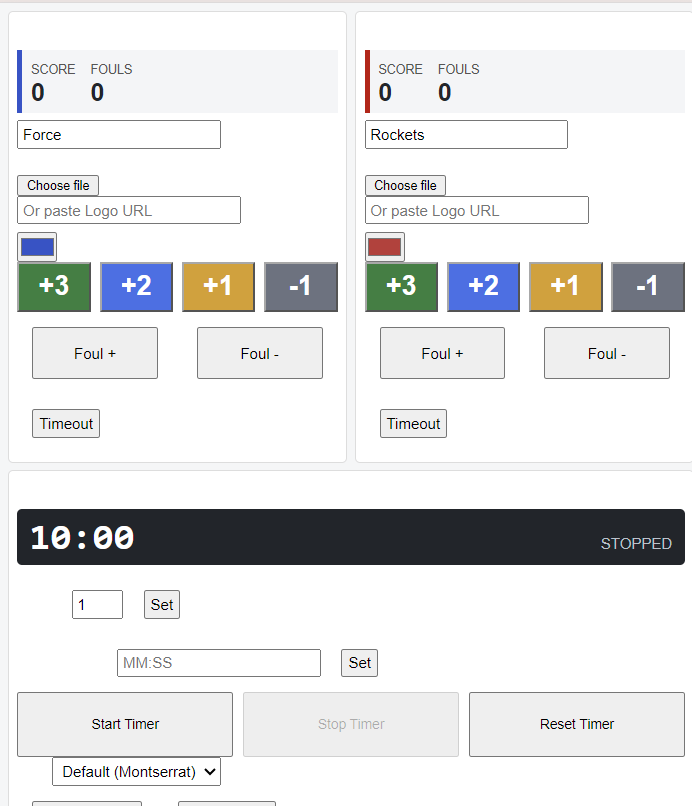
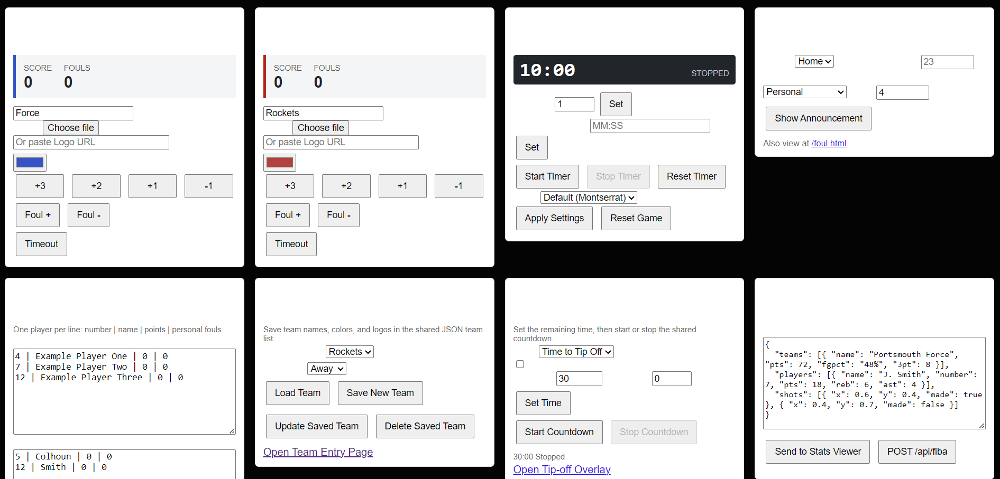
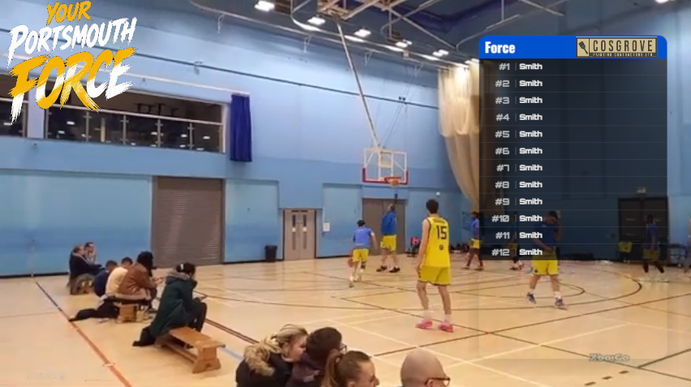
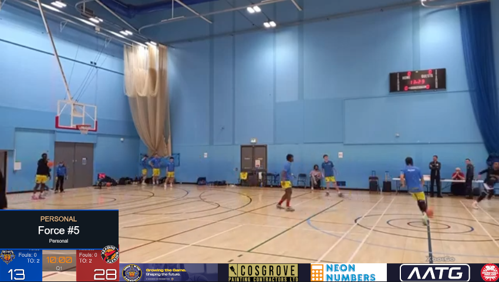

# Scoreboard Scripting

This is a Javascript app that allows for the generation of streaming assets with easy integration into OBS. It is designed to be used from a laptop for set-up and then a phone for during play. This allows a scorer and filmer to work as the same person or seperate.

The elements that are made on the end points and be overlayed bu HTML into OBS, and then easily controlled from a laptop (full controls) or a mobile by just using the web controls (sub-set of the controls). I use a camera to stream it then a cold shoe phone mount to control the stream elements. 

The FIBA stats are currently a work in progress and don't currently work. I am also looking into integration of Basketball Englands Play HQ, both for live stats and live score/scoreboard. 

A browser-based basketball scoreboard for Portsmouth Force. The control panel updates the main display and overlay pages in real time using Socket.IO.

## Not Working
- Logos
- FIBA integration

## Features

- Live home and away scores with one-point undo controls.
- FIBA-style game clock, quarter controls, fouls, bonus indicators, and timeouts.
- Configurable team names, colours, logos, fonts, and player line-ups.
- Saved team profiles in `teams.json`, manageable from the control panel.
- Transparent tip-off, line-up, and foul announcement overlays for production use.
- FIBA Live Stats preview with a shot map, team statistics, and player statistics.
- Browser-based control panel with no database or build step required.

## Requirements

- Node.js 18 or newer, including npm.

## Start Locally

### Direct npm commands

```powershell
npm ci
npm start
```

The default port is `3000`. 

Stop the server with `Ctrl+C`.

Connect on a phone by using the host IP address. All end points are visable. (Control.html has custom layout)

## Endpoints

All pages are served from `public/` by the Express static-file server.

| URL | Purpose |
| --- | --- |
| `/` | Main scoreboard display |
| `/control` | Live operator control panel |
| `/team-entry` | Create and edit saved teams and numbered players |
| `/tipoff` | Transparent pre-game countdown overlay |
| `/lineup` | Line-up overlay; use `?team=home`, `?team=away`, or `?pregame=1` |
| `/foul` | Foul announcement overlay |
| `/stats` | FIBA Live Stats preview viewer |
| `/api/teams` | List, save, and delete saved team profiles |
| `POST /api/fiba` | Broadcast a JSON stats payload to connected stats viewers - currently defective|

## Example Stream

       